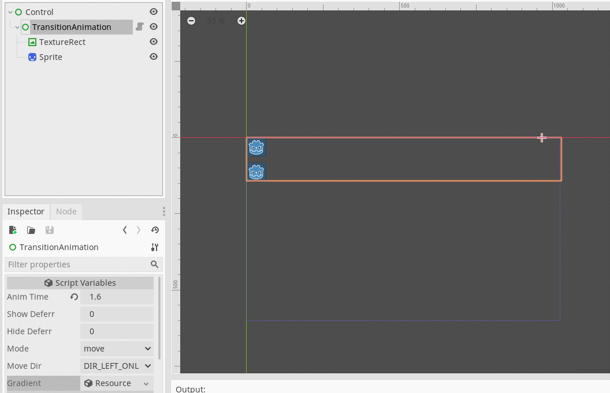

# TransitionAnimation
 Godot plugin. For easy set show/hide toggle animation.

# Screenshot

# Document
[Chinese document link](https://shimo.im/docs/rptwyk8gqcGRhYJQ/)

# Installing
[Installing plugins link](https://docs.godotengine.org/en/stable/tutorials/plugins/editor/installing_plugins.html)
